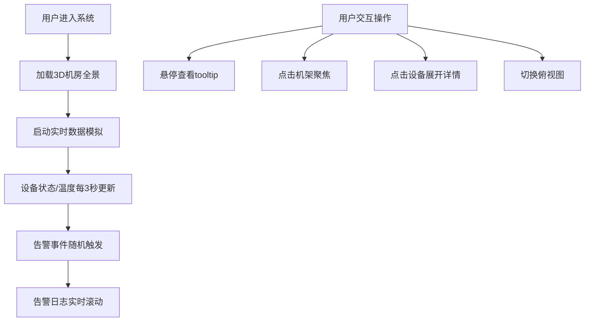

## 1. 产品概述

基于Three.js+React的3D数据中心机房可视化监控系统，实现机房设备的实时监控、温度热力图展示、告警管理和交互导航。

- 主要目的：通过3D可视化技术直观展示数据中心机房的运行状态，帮助运维人员快速定位问题、监控设备健康状况
- 目标用户：数据中心运维人员、IT管理人员、数据中心运营团队
- 产品价值：提升数据中心运维效率，降低故障响应时间，优化能源利用效率

## 2. 核心功能

### 2.1 用户角色

| 角色 | 注册方式 | 核心权限 |
|------|----------|----------|
| 运维人员 | 系统内置账号 | 查看机房全景、设备详情、告警信息，交互操作3D场景 |

### 2.2 功能模块

1. **机房全景页面**：3D机房场景渲染、设备状态展示、温度热力图叠加
2. **设备详情面板**：设备基本信息、历史趋势图表、实时数据展示
3. **告警日志面板**：实时告警滚动展示、告警级别标识、告警详情查看
4. **统计状态栏**：总体运行指标展示、关键KPI实时更新

### 2.3 页面详情

| 页面名称 | 模块名称 | 功能描述 |
|-----------|-------------|---------------------|
| 机房全景 | 3D场景模块 | 渲染4排32个机柜、架高地板、吊顶天花板、冷热通道标识，透明墙壁可透视内部 |
| 机房全景 | 设备展示模块 | 机架内服务器按U数堆叠展示，状态颜色区分（绿/黄/红/灰），悬停显示tooltip |
| 机房全景 | 热力图模块 | 地面温度热力图叠加，机架顶部温度标注，超标区域闪烁告警 |
| 机房全景 | 数据模拟模块 | 每3秒更新设备数据，随机触发告警事件，右侧告警日志实时滚动 |
| 机房全景 | 交互导航模块 | OrbitControls自由视角，点击机架聚焦，点击设备展开详情，俯视图切换 |
| 机房全景 | 统计面板模块 | 顶部状态栏展示总设备数/在线数/告警数/离线数、总功耗、PUE、机柜利用率、冷却效率 |
| 设备详情 | 趋势图表模块 | 折线图展示最近5分钟CPU/温度趋势，支持多指标对比 |

## 3. 核心流程

用户进入系统后，页面加载3D机房全景，模拟数据开始实时运行。用户可以：
1. 自由旋转/缩放视角查看机房
2. 鼠标悬停查看设备tooltip信息
3. 点击机架相机平滑聚焦
4. 点击具体设备展开详情面板
5. 切换俯视图查看整体布局
6. 查看右侧告警日志面板
7. 查看顶部统计指标

## 4. 用户界面设计

### 4.1 设计风格
- 设计方向：科技感、未来感、深色工业风
- 主色调：深蓝色(#0a1628)作为背景，青色(#00d4ff)作为主强调色
- 辅助色：绿色(#00ff88)正常、黄色(#ffcc00)告警、红色(#ff4444)故障、灰色(#666)空闲
- 字体：使用JetBrains Mono作为等宽字体，搭配Inter作为UI字体
- 按钮风格：半透明玻璃态，带发光边框，悬停时有辉光动画
- 布局风格：全屏3D场景作为主体，顶部固定状态栏，右侧固定告警面板，设备详情弹层居中展示
- 图标风格：线性简约风格，使用lucide-react图标库

### 4.2 页面设计概述

| 页面名称 | 模块名称 | UI元素 |
|-----------|-------------|-------------|
| 机房全景 | 3D场景 | 深色背景、透明玻璃机房、金属质感机柜、发光状态指示灯、网格地板纹理、灯管发光效果 |
| 机房全景 | 热力图 | 从蓝色(冷)到红色(热)的渐变色带，半透明叠加在地面上，热通道区域明显偏红 |
| 机房全景 | Tooltip | 半透明深色卡片，带发光边框，显示设备名称/IP/CPU/内存/温度等信息 |
| 机房全景 | 告警面板 | 右侧固定高度滚动面板，告警条目按时间倒序排列，不同级别用不同颜色标识 |
| 机房全景 | 统计面板 | 顶部半透明状态栏，关键指标用大号数字展示，带有微小的数字跳动动画 |
| 设备详情 | 详情面板 | 居中弹出的半透明深色卡片，上方展示设备信息，下方展示折线图表 |

### 4.3 响应式
- 桌面端优先设计，适配1920×1080及以上分辨率
- 3D场景自适应浏览器窗口大小
- 统计面板和告警面板在小屏幕上可折叠

### 4.4 3D场景指导
- **环境/HDRI和氛围**：深色科技感环境，使用冷色调环境光，配合设备发光效果营造赛博朋克氛围
- **灯光设置**：主光源模拟天花板灯管，环境光提供基础照明，设备自身有发光材质
- **相机设置**：初始相机位置在机房斜上方45度，可通过OrbitControls自由旋转/缩放/平移
- **相机运动**：点击机架时相机平滑移动到机架正前方，有缓动效果
- **构图和焦点元素**：机房为中心构图，设备状态灯和热力图作为视觉焦点
- **交互和动画**：设备状态变化时有颜色过渡动画，温度超标区域有闪烁动画，tooltip淡入淡出
- **后处理效果**：轻微的泛光效果，增强科技感
- **性能预算**：32个机柜，每个机柜约20个设备，总几何体数量控制在合理范围，确保60fps运行

