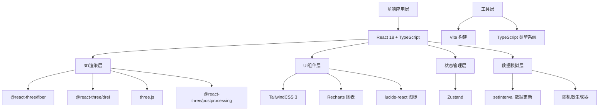
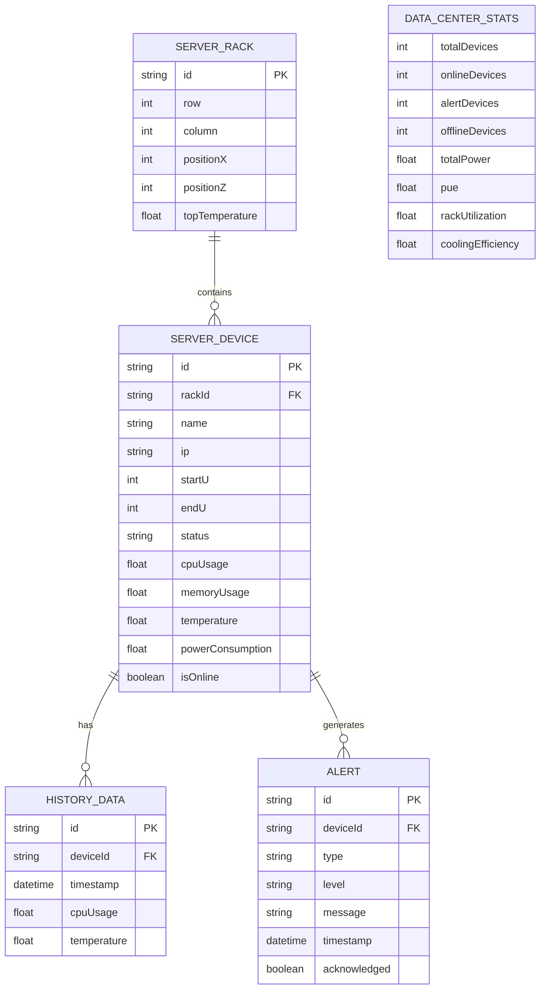

## 1. 架构设计



## 2. 技术描述

- **前端框架**：React 18 + TypeScript + Vite
- **3D渲染**：
  - three.js - 3D图形引擎核心
  - @react-three/fiber - React的Three.js渲染器
  - @react-three/drei - Three.js的React组件库（OrbitControls等）
  - @react-three/postprocessing - 后处理效果（泛光等）
- **UI框架**：TailwindCSS 3
- **图表库**：Recharts
- **状态管理**：Zustand
- **图标库**：lucide-react
- **构建工具**：Vite 5
- **初始化工具**：vite-init，使用react-ts模板

## 3. 项目结构

```
src/
├── components/
│   ├── three/              # 3D相关组件
│   │   ├── DataCenter.tsx      # 机房整体组件
│   │   ├── ServerRack.tsx      # 机柜组件
│   │   ├── ServerDevice.tsx    # 服务器设备组件
│   │   ├── HeatMap.tsx         # 热力图组件
│   │   └── Environment.tsx     # 环境组件（地板/天花板/墙壁）
│   ├── ui/                 # UI组件
│   │   ├── StatsBar.tsx        # 顶部状态栏
│   │   ├── AlertPanel.tsx      # 告警面板
│   │   ├── DeviceTooltip.tsx   # 设备Tooltip
│   │   └── DeviceDetail.tsx    # 设备详情面板
│   └── layout/
│       └── AppLayout.tsx       # 应用布局
├── hooks/
│   ├── useDataSimulation.ts    # 数据模拟Hook
│   └── useCameraControls.ts    # 相机控制Hook
├── store/
│   └── useDataCenterStore.ts   # Zustand状态管理
├── types/
│   └── index.ts                # 类型定义
├── utils/
│   └── helpers.ts              # 工具函数
├── pages/
│   └── Home.tsx                # 首页（机房全景）
├── App.tsx
├── main.tsx
└── index.css
```

## 4. 路由定义

| 路由 | 用途 |
|-------|---------|
| / | 机房全景页面（主页面） |

## 5. 数据模型

### 5.1 数据模型定义



### 5.2 TypeScript类型定义

```typescript
// 设备状态
export type DeviceStatus = 'running' | 'warning' | 'fault' | 'idle';

// 告警级别
export type AlertLevel = 'info' | 'warning' | 'critical';

// 服务器设备
export interface ServerDevice {
  id: string;
  rackId: string;
  name: string;
  ip: string;
  startU: number;
  endU: number;
  status: DeviceStatus;
  cpuUsage: number;
  memoryUsage: number;
  temperature: number;
  powerConsumption: number;
  isOnline: boolean;
  history: HistoryData[];
}

// 机柜
export interface ServerRack {
  id: string;
  row: number;
  column: number;
  positionX: number;
  positionZ: number;
  topTemperature: number;
  devices: ServerDevice[];
  usedU: number;
  totalU: number;
}

// 历史数据
export interface HistoryData {
  timestamp: number;
  cpuUsage: number;
  temperature: number;
}

// 告警
export interface Alert {
  id: string;
  deviceId: string;
  deviceName: string;
  type: string;
  level: AlertLevel;
  message: string;
  timestamp: number;
}

// 统计数据
export interface DataCenterStats {
  totalDevices: number;
  onlineDevices: number;
  alertDevices: number;
  offlineDevices: number;
  totalPower: number;
  pue: number;
  rackUtilization: number;
  coolingEfficiency: number;
}

// 温度点
export interface TemperaturePoint {
  x: number;
  z: number;
  temperature: number;
}
```

## 6. 核心配置

### 6.1 Vite配置（3435端口）
```typescript
// vite.config.ts
export default defineConfig({
  server: {
    port: 3435,
    host: true
  }
});
```

### 6.2 机房尺寸配置
- 机房总尺寸：40m × 25m × 6m
- 机柜尺寸：0.6m × 1.0m × 2.0m (42U)
- U位高度：约4.76cm
- 通道宽度：冷通道2m，热通道1.5m
- 机柜布局：4排×8个=32个机柜

